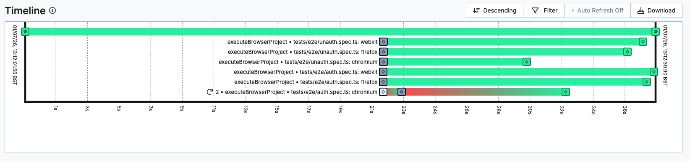

# Scaling Playwright with Temporal

A reference implementation demonstrating how Temporal can orchestrate large
Playwright end-to-end suites as durable, distributed workflows instead of a
single `playwright test` execution on one CI runner.

> **Read this first.** The web application in this repository is deliberately
> trivial — a small login page. It exists only to give Playwright something
> realistic to test. **It is not the point.** The point is how those tests are
> orchestrated. Ignore the application; study the orchestration.

<!-- toc -->

* [The problem](#the-problem)
* [Why Temporal?](#why-temporal)
* [Architecture](#architecture)
* [What this repository demonstrates](#what-this-repository-demonstrates)
* [Scaling](#scaling)
* [Running the demonstration](#running-the-demonstration)
  * [Secrets](#secrets)
  * [Variables](#variables)
* [Simulating flaky tests](#simulating-flaky-tests)

<!-- Regenerate with "pre-commit run -a markdown-toc" -->

<!-- tocstop -->

## The problem

Teams with large end-to-end suites tend to hit the same wall, regardless of how
well-written the tests are:

* **Flaky tests fail the build.** A single intermittent failure — a slow render,
  a race, a network blip — fails the whole run, even though a rerun would pass.
* **Reruns are all-or-nothing and expensive.** The usual remedy is to re-run the
  entire pipeline. Thousands of tests are repeated to recover from one flaky
  result, burning time and CI minutes.
* **Pipelines are long and serial.** End-to-end tests are slow by nature. As the
  suite grows, the critical path grows with it, and feedback to engineers slows
  down.
* **One machine has a ceiling.** The instinctive fix is a bigger CI runner. But
  a single machine — however large — can only run so many browsers at once. You
  eventually pay more for diminishing returns, and you are still bounded by one
  box.

For a large organisation running thousands of end-to-end tests across many
teams, these are not edge cases. They are a daily tax on delivery.

## Why Temporal?

Temporal is a durable execution engine. Applied to a test suite, it changes the
unit of work from "the whole run" to "one independent execution", and gives each
of those executions reliability and visibility for free:

* **Recover automatically from flaky tests.** Each execution is retried on
  failure with backoff. A test that passes on the second attempt no longer fails
  the build.
* **Retry only what failed.** When a browser run is flaky, Temporal retries
  *that execution* — not the entire suite. You stop paying to repeat thousands
  of passing tests to recover one.
* **Distribute work across many Workers.** Executions are pulled from a shared
  task queue by any number of Workers, on any number of machines. Adding
  capacity means adding Workers, not buying a bigger runner.
* **Scale horizontally.** The orchestration is identical whether it runs on one
  machine or a fleet. Growth is a capacity decision, not a rewrite.
* **Durable, observable, and resilient.** Every run has a complete, queryable
  execution history. A failure tells you exactly which browser failed and why.
  If a Worker dies mid-run, its in-flight work is retried elsewhere rather than
  lost.

> **Temporal does not make Playwright faster.**
>
> Individual tests take exactly as long as they always did. What Temporal
> changes is everything *around* the tests, making a large suite **more
> reliable, more scalable and easier to operate**.

## Architecture

The execution model is a simple, layered fan-out, with a clean separation of
responsibilities: the **client discovers** the work, the **Workflow
orchestrates** it, and the **Activities execute** it.

```text
        Client              discovers the work; builds the execution plan
           │
           ▼
        Workflow            orchestrates the plan; deterministic; no test logic
           │
           ▼
   Browser Activities       one independent, retryable unit of work each
           │
           ▼
       Playwright           drives the browser against its own app instance
           │
           ▼
      Application           a fresh instance per Activity, on its own port
```

The Workflow knows nothing about Playwright, and nothing about *how* the work
was discovered. It simply orchestrates a supplied collection of independent
units of work.

Playwright happens to be the implementation used by the Activities.

* The **Client** decides *what* to run. It discovers the Playwright work,
  constructs a strongly-typed execution plan (a list of `BrowserExecution` work
  items — one spec against one browser project each), and starts the Workflow
  with that plan. Today it reproduces the demonstration exactly (one spec fanned
  out across `chromium`, `firefox` and `webkit`), but this is the seam where
  richer discovery — multiple spec files, Playwright shards, tagged groups —
  slots in without touching the Workflow or Activity contracts.
* The **Workflow** is a pure orchestrator. It takes the supplied executions,
  fans out one Activity per execution, lets Temporal retry and run them
  concurrently, and aggregates the results. It contains no test, browser, shell
  or discovery logic.
* Each **Activity** executes exactly one supplied work item. It owns its own
  application instance: it allocates a free port dynamically, starts the app on
  it, and points Playwright at it. Nothing is shared between Activities, and an
  Activity never discovers specs, chooses browser projects or inspects the
  filesystem — it simply runs the one execution it was handed.
* Because each Activity is fully self-contained, it can run **alongside many
  others on one machine, or on a different machine entirely** — with no change
  to the orchestration. That property is what makes the pattern scale.

## What this repository demonstrates

The client discovers a single Playwright spec fanned out across browser
projects (`chromium`, `firefox`, `webkit`) and hands that plan to the Workflow,
which runs **one Activity per browser**. From that you can observe:

* **Fan-out** — browser runs execute concurrently as independent Activities.
* **Automatic retries** — flaky browser runs are retried with backoff and
  recover without failing the suite.
* **Honest failure** — when a browser exhausts its retries, the Workflow fails
  and reports exactly which browser(s) failed and why.
* **Isolated app instances** — every Activity runs its own application on a
  **dynamically allocated port**, so any number can run concurrently without
  colliding.
* **Graceful Worker lifecycle** — in CI, Workers shut themselves down cleanly
  once the run completes, letting in-flight work finish first.

**Why fan out by browser?** Purely because it makes the demonstration easy to
follow. The unit of fan-out is a *discovery* detail, decided entirely on the
client side when it builds the execution plan. Because the Workflow only ever
sees a list of `BrowserExecution` work items, the **exact same orchestration**
applies, unchanged, to:

* individual **spec files**
* **Playwright shards**
* **tagged test groups**

Change what the client discovers; the Workflow and Activity contracts stay the
same.



*Temporal Web showing six independent browser executions (two spec files × three
browsers). One execution fails, is retried automatically and then succeeds without
affecting the other Activities.*

## Scaling

The insight worth internalising: **the bottleneck is rarely the application.**
The application under test is usually cheap to run. The challenge is executing
*thousands of end-to-end tests* quickly and reliably.

With this pattern, that work is pulled from a shared task queue by as many
Temporal Workers as you choose to run.

Need more throughput?

Provision more Workers. The limiting factor becomes **how many Workers you provision**,
not the CPU and memory of a single CI runner.

This is the key shift for large organisations: you stop scaling *up* (ever-
larger, ever-more-expensive runners with a hard ceiling) and start scaling *out*
(more independent Workers, across as many machines as you like). The GitHub Actions
workflow demonstrates this using a matrix of Workers, but the same pattern applies
equally to ephemeral virtual machines, containers or Kubernetes pods.

## Running the demonstration

The primary demonstration is **GitHub Actions** (see
[`.github/workflows/playwright.yml`](.github/workflows/playwright.yml)). It is
the easiest way to see multiple Temporal Workers collaboratively execute a
single Workflow, each pulling work from the same task queue.

To try the demonstration yourself:

1. Fork this repository.
2. Create or use an existing **Temporal Cloud** Namespace.
3. Create a Temporal Cloud API key with access to that Namespace.
4. Configure the following GitHub repository settings in your fork.

### Secrets

* `TEMPORAL_ADDRESS`
* `TEMPORAL_API_KEY`

### Variables

* `TEMPORAL_NAMESPACE`
* `TEMPORAL_TLS_ENABLED`

Once configured, simply run the **Playwright Tests** GitHub Actions workflow.

The workflow provisions multiple Temporal Workers that collaboratively execute a
single Workflow, demonstrating the same orchestration pattern that could be used
with a larger fleet of workers in production.

GitHub Actions is **only the demonstration environment**. In production, the
same orchestration pattern could be used with any worker fleet. For example, a
CI pipeline might start a Workflow and then provision a fleet of ephemeral
virtual machines, containers or Kubernetes pods running the Temporal Worker.
Those Workers would all poll the same task queue until the Workflow completed,
then shut themselves down.

## Simulating flaky tests

> This mechanism exists purely to demonstrate Temporal's retry behaviour. It is
> not intended to model real-world failure rates.

The tests themselves are reliable, so flakiness is simulated on demand via
`PLAYWRIGHT_SIMULATED_FLAKY_PERCENTAGE` — the probability, per attempt, that a
browser run is failed on purpose before executing the Playwright test run:

| Value | What it demonstrates                                                                                                 |
| ----- | -------------------------------------------------------------------------------------------------------------------- |
| `0`   | No simulated flakiness (the default). Every run passes on the first attempt.                                         |
| `33`  | Roughly a third of Activity attempts fail. Temporal retries them; the suite still passes. This is the value CI uses. |
| `100` | Every attempt fails. Retries are exhausted and the Workflow fails — showing how genuine failure surfaces.            |
